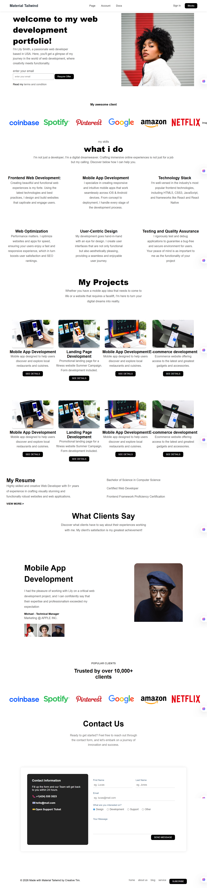

## Overview
This portfolio is a basic front-end project created using HTML and CSS. It is a cloned design that I rebuilt to practice my development skills and understand how real websites are structured.

## Features
Clean and simple user interface
Fully built using HTML and CSS
Multiple sections (Home, About, Projects, Contact)
Smooth layout and organized content structure
Navigation bar for easy movement between sections
Basic styling with colors, fonts, and spacing
Beginner-friendly and easy to understand code

## Project ScreenShot

